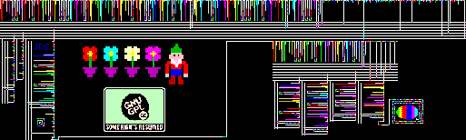
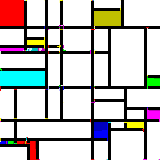

# Piet programs
A (subset) of the programs that can be found in this repo.

## Day of the week
By Jonathan Couper-Smartt.

## FizzBuzz!
By Corniel Nobel

## Gnome Sort
By Joshua Schulter

## Pi
By Richard Mitton

## Prime tester
By Kyle Woodward

## More ...
More programs can be found at [https://www.dangermouse.net/esoteric/piet/samples.html](dangermouse.net).
